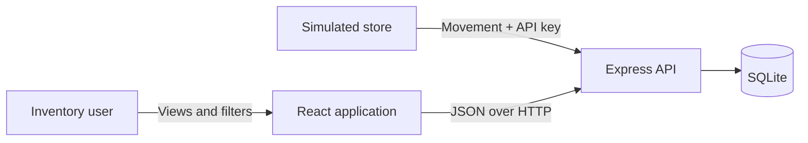
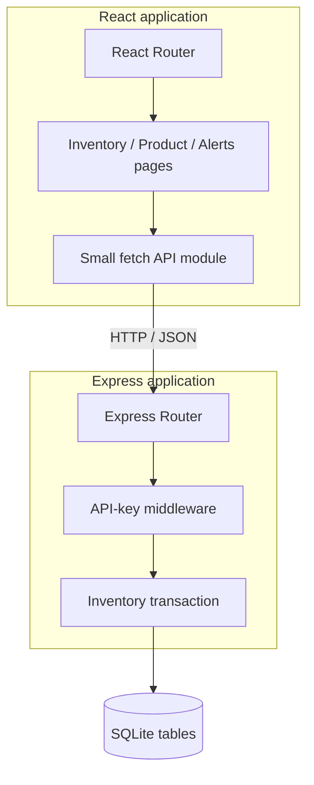
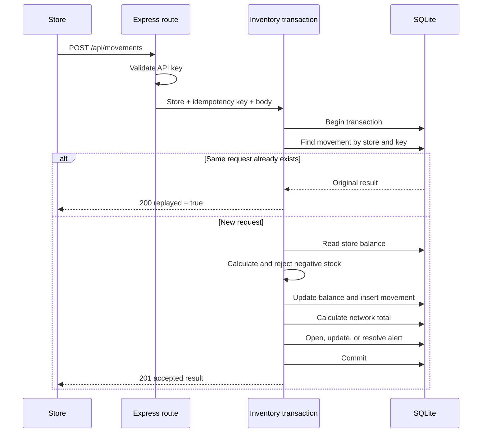

[← README](/README.md) | [← Requirements](requirements.md) | **Architecture and Routing** | [Data Model and API →](data-and-api.md)

---

# Architecture and Routing

## The architecture in one sentence

A React single-page application calls one Express API, and the API uses one
SQLite database as the source of truth.

## System context



## Why a modular monolith

The challenge is completed by one student and demonstrated in six minutes. A
single deployable server keeps setup and debugging simple. Modules still
separate routing, authentication, business logic, and database access, so the
solution is organized without becoming fragmented.

This choice avoids:

- microservices and message brokers;
- an ORM and generated migrations;
- a client state-management library;
- separate repositories or shared contract packages.

These are valid tools for larger systems, but they add concepts that are not
needed to prove the challenge requirements.

## Component view



## Router maps

Express Router answers: **Which server function handles this HTTP request?**

| Route module | Mounted path | Responsibility |
|---|---|---|
| `movements.js` | `/api/movements` | Authenticated stock writes |
| `inventory.js` | `/api/inventory` | Inventory list, filters, and product detail |
| `alerts.js` | `/api/alerts` | Alert list and threshold update |
| `stores.js` | `/api/stores` | Store options for the interface |

React Router answers: **Which page appears for this browser URL?**

| Browser route | Page |
|---|---|
| `/inventory` | Network inventory and API movement simulator |
| `/products/:sku` | Store balances and recent movements for one product |
| `/alerts` | Open, resolved, or all alerts |

The two routers solve the same navigation idea at different boundaries. This
parallel makes them easy to learn together.

## Critical write flow



## Consistency and concurrency

SQLite runs in WAL mode with a five-second busy timeout. The write operation is
a synchronous `better-sqlite3` transaction. Within this one Node.js process,
stock writes cannot interleave inside the critical section.

The database also has a unique constraint on `(store_id, idempotency_key)`.
This is the final protection against counting the same store request twice.

The movement table is the audit history. The balance table is the current state
used for fast reads. Both are updated inside the same transaction.

## Source structure

```text
/
  server/
    src/
      routes/
      middleware/
      app.js
      database.js
      inventory.js
      server.js
    test/
  client/
    src/
      pages/
      components/
      api.js
      App.jsx
      styles.css
  docs/
    architecture.md
    data-and-api.md
    delivery-plan.md
    requirements.md
    traceability.md
    ux-design.md
```

## Key decisions and tradeoffs

| Decision | Benefit for this exercise | Limitation |
|---|---|---|
| Plain JavaScript | Less syntax and build configuration to learn | Fewer compile-time checks than TypeScript |
| Visible SQL | Data behavior is easy to trace | More manual mapping than an ORM |
| SQLite | Zero-service local setup and real transactions | Not a multi-region production database |
| One network threshold per product | Directly satisfies the challenge | No store-specific thresholds |
| Native `fetch` and React state | Few client concepts | No caching library |
| Modular monolith | Easy to run, test, and explain | Would need evolution for very large scale |

## Production evolution

If the fictional network became real and global, the next steps would be
PostgreSQL, a managed identity provider, an outbox for reliable events,
observability, rate limiting, and separate read models. They are described only
as an evolution path and are not presented as implemented features.


---

[? README](/README.md) | [? Requirements](requirements.md) | **Architecture and Routing** | [Data Model and API ?](data-and-api.md)
