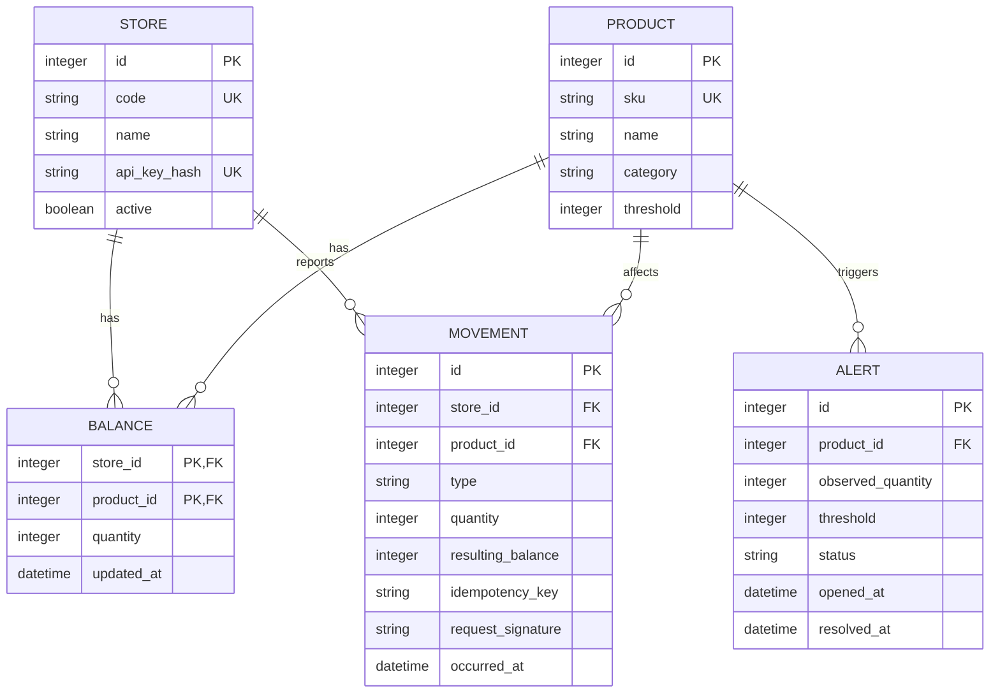

[← README](/README.md) | [← Architecture](architecture.md) | **Data Model and API** | [UX Design →](ux-design.md)

---

# Data Model and API

## Data model

The model uses five tables. API keys are stored as a hash on the store record to
avoid a sixth table in this learning-focused MVP.



## Endpoint summary

| Method | Route | Purpose | Authentication |
|---|---|---|---|
| `POST` | `/api/movements` | Report stock in or out | `X-API-Key` |
| `GET` | `/api/inventory` | List consolidated inventory with filters | Public demo |
| `GET` | `/api/inventory/:sku` | Product, stores, and movements | Public demo |
| `GET` | `/api/alerts?status=OPEN` | List alerts | Public demo |
| `PUT` | `/api/alerts/thresholds/:sku` | Change product threshold | `X-Admin-Key` |
| `GET` | `/api/stores` | List active stores | Public demo |
| `GET` | `/health` | Confirm API and database availability | Public |

## Report a movement

```http
POST /api/movements
X-API-Key: store-bogota-key
Idempotency-Key: sale-bog-000184
Content-Type: application/json

{
  "productSku": "SAMBA-OG-WHT-42",
  "type": "OUT",
  "quantity": 2,
  "occurredAt": "2026-07-30T18:42:13Z",
  "reference": "SALE-90831"
}
```

Successful response:

```json
{
  "data": {
    "movementId": 1,
    "storeCode": "BOG-CALLE82",
    "productSku": "SAMBA-OG-WHT-42",
    "type": "OUT",
    "quantity": 2,
    "resultingBalance": 4,
    "networkTotal": 8,
    "replayed": false,
    "alertOpened": false
  }
}
```

A safe retry sends the exact same body and idempotency key. It returns `200`
with `replayed: true`. Reusing the key with different data returns `409`.

## Inventory filters

```http
GET /api/inventory?product=samba&store=BOG-CALLE82&maxStock=10
```

| Parameter | Rule |
|---|---|
| `product` | Case-insensitive partial match against SKU or name |
| `store` | Exact store code; returns products present in that store |
| `maxStock` | Non-negative integer applied to the consolidated network total |

Each product result contains its network total, threshold, and status. Without a
store filter it includes the complete store breakdown; with a store filter the
breakdown contains only that store. The network total remains consolidated and
is never accepted from a client.

## Configure a threshold

```http
PUT /api/alerts/thresholds/SAMBA-OG-WHT-42
X-Admin-Key: admin-demo-key
Content-Type: application/json

{
  "quantity": 9
}
```

The next movement for that product evaluates the new threshold. The update
endpoint is intentionally small for the demonstration.

## Error format

```json
{
  "error": {
    "code": "INSUFFICIENT_STOCK",
    "message": "The movement would make store stock negative.",
    "requestId": "db0d4f91-...",
    "details": {
      "available": 2,
      "requested": 3
    }
  }
}
```

| Status | Meaning |
|---|---|
| `400` | Required header or request shape is missing |
| `401` | Store or admin credential is missing or invalid |
| `404` | Route or product does not exist |
| `409` | Negative stock or idempotency conflict |
| `422` | A field or filter is invalid |
| `500` | Unexpected server error |

## Seed data

Three fictional stores and three fictional product variants are inserted when
the database is empty. The reset command recreates exactly the same state, which
makes the live demonstration repeatable.


---

[? README](/README.md) | [? Architecture](architecture.md) | **Data Model and API** | [UX Design ?](ux-design.md)
