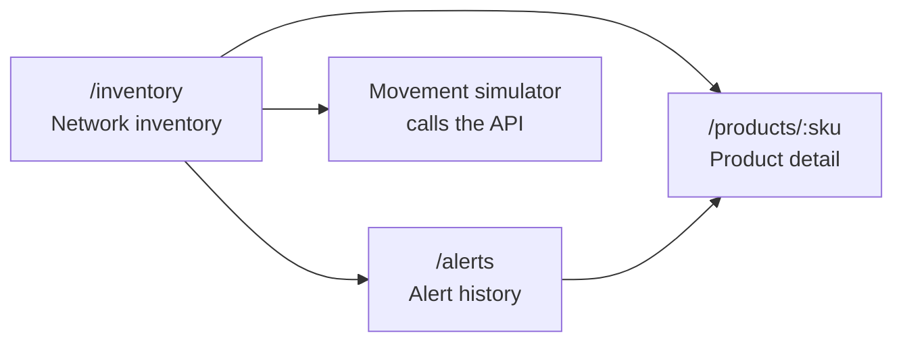
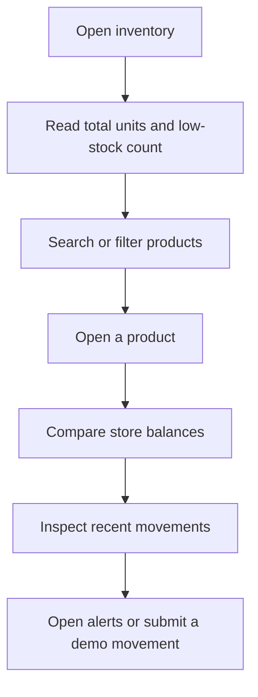

[← README](/README.md) | [← Data Model and API](data-and-api.md) | **UX Design** | [Delivery Plan →](delivery-plan.md)

---

# UX Design

## Experience goal

The interface must answer two questions quickly:

1. Which products have low stock across the network?
2. Which store balances and movements explain that result?

The dashboard supports the API demonstration. It is not presented as a complete
inventory management product.

## Information architecture

React Router makes each important state addressable with a clear URL. The
product SKU appears in the detail URL, so an evaluator can understand what is
being displayed.

## Primary user flow

## Screen 1: network inventory

- Strong problem-focused heading and two summary metrics
- Search by SKU or product name
- Exact store filter
- Maximum network stock filter
- Semantic table with total, threshold, text status, and detail link
- Loading, error, and empty states
- Built-in movement simulator for the live API demonstration

## Screen 2: product detail

- Product name, SKU, category, and current status
- Network total and configured threshold
- Store-by-store balances with text values and supporting bars
- Recent movement history with type, quantity, store, balance, and time
- Clear route back to inventory

## Screen 3: alerts

- Open, resolved, and all status filters
- Observed quantity and threshold
- Text-based status
- Link to the affected product
- Helpful empty state that tells the evaluator how to create an alert

## Visual direction

- Editorial sports-dashboard feeling without copying an official interface
- Near-black ink, warm neutral surface, and one high-energy lime signal color
- Square cards, visible borders, strong type hierarchy, and generous spacing
- No official adidas logo, photography, trademark graphic, or proprietary asset
- Fictional demo product and store data clearly labeled

The lime color is not the only status signal. Text, symbols, borders, and labels
repeat the meaning.

## Accessibility

- Semantic header, navigation, main, footer, forms, tables, and lists
- Every input has a visible label
- Visible keyboard focus
- Minimum 46 px form controls and actions
- Status information is not color-only
- Horizontal table scrolling is contained on narrow screens
- Layout adapts at 900 px and 620 px
- Reduced-motion preference is respected
- Error and success feedback use live regions

## Wireframe artifact

The editable three-screen board is
[wireframes.svg](../design/wireframes.svg), with a
[PNG preview](../design/wireframes.png). It maps directly to the three React
routes and deliberately remains a low-fidelity artifact so the design reasoning
is visible.

---

[? README](/README.md) | [? Data Model and API](data-and-api.md) | **UX Design** | [Delivery Plan ?](delivery-plan.md)
